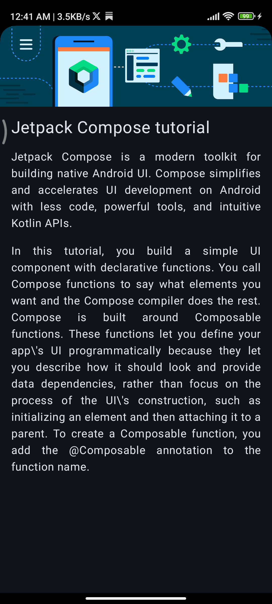

# Compose Article

A simple Jetpack Compose application built as part of the **Android Basics with Compose** course.

## Screenshot

<p align="center">
  
</p>

## Features

* Displays an article image
* Displays an article title and content
* Uses Jetpack Compose layouts and modifiers
* Demonstrates text formatting using `TextAlign.Justify`
* Uses string and drawable resources
* Built with Material 3 and Jetpack Compose

---
## Problem Statement

This project was completed as part of the Android Developers **Compose Practice Problems** codelab.

Problem statement and requirements:

[compose article app problem statement](https://developer.android.com/codelabs/basic-android-kotlin-compose-composables-practice-problems?continue=https%3A%2F%2Fdeveloper.android.com%2Fcourses%2Fpathways%2Fandroid-basics-compose-unit-1-pathway-3%23codelab-https%3A%2F%2Fdeveloper.android.com%2Fcodelabs%2Fbasic-android-kotlin-compose-composables-practice-problems#1)

The goal of this exercise was to build an article screen using Jetpack Compose by displaying an image, title, and article content while applying proper layout, styling, and text formatting techniques.


## Learning Process and Observations

While building this project, I used my previous **Happy Birthday Compose App** as a reference because many concepts were similar, such as Images, Text, Modifiers, and Composable functions.

Initially, I approached the Article screen with the same mindset as the Happy Birthday project. Since the Birthday app used a `Box` layout to place text on top of an image, I started thinking along the same lines.

However, after comparing the expected output with my preview, I realized that the Article screen had a completely different layout structure.

### Why I Changed from Box to Column

#### Happy Birthday App

* Image is used as a background.
* Text is displayed on top of the image.
* `Box` is the correct choice because the elements need to overlap.

#### Compose Article App

* Image is displayed first.
* Title appears below the image.
* Paragraphs appear below the title.
* No overlapping is required.
* `Column` is the correct choice because elements are arranged vertically.

As soon as I realized the output required a vertical arrangement instead of overlapping content, I replaced `Box` with `Column`. This change immediately brought my layout much closer to the expected design and helped me understand the practical difference between these two layout composables.

### Text Alignment Learning

Initially, I used:

```kotlin
Modifier.align(Alignment.CenterHorizontally)
```

Later, after comparing my solution with the official solution, I learned that this only changes the position of the `Text` composable inside its parent layout.

The official solution used:

```kotlin
textAlign = TextAlign.Justify
```

This formats the text itself and makes paragraphs appear more like a properly formatted article.

#### Key Takeaway

* `Modifier.align(...)` → Layout alignment
* `TextAlign.Justify` → Text formatting

### My Solution vs Official Solution

#### My Approach

Created separate composables:

* `ComposeArticleImage()`
* `ComposeArticleText()`

#### Official Solution

Used a single composable (`ArticleCard`) containing both the Image and Text components.

#### Observation

* Both approaches work correctly.
* The official solution is more compact for a small screen.
* My approach helped me better understand composable decomposition and component separation.
* Comparing both implementations helped me understand that there can be multiple valid ways to solve the same UI problem.

### Modifier Learning

While comparing my code with the official solution, I noticed the common Compose pattern:

```kotlin
modifier: Modifier = Modifier
```

and later:

```kotlin
Column(modifier = modifier)
```

I learned that:

* This is a standard Compose convention.
* It allows composables to be customized by their caller.
* If a modifier parameter is declared but never used, Android Studio shows:

```text
Parameter 'modifier' is never used
```

### Additional Observation

The layout looked slightly different in the emulator compared to the expected output.

After testing on a real device, the UI matched the expected design.

This taught me that:

* Compose Preview
* Android Emulator
* Physical Device

can sometimes display UI slightly differently due to system UI behavior, display cutouts, screen configurations, and device-specific settings.

---

## Concepts Practiced

* Composable Functions
* Column Layout
* Image Composable
* Text Composable
* Modifiers
* Resource Management
* String Resources
* Text Alignment
* Compose Preview
* Material 3

---

## Technologies Used

* Kotlin
* Jetpack Compose
* Android Studio
* Material 3

---

## Reference

Official Android Developers solution used for comparison and learning:

[Official Android Developers Compose Article Solution](https://github.com/google-developer-training/basic-android-kotlin-compose-training-practice-problems/blob/main/Unit%201/Pathway%203/ComposeArticle/app/src/main/java/com/example/composearticle/MainActivity.kt)

I completed the project independently before reviewing the official implementation. After comparing both solutions, I documented the differences, observations, and lessons learned in this README.

---

## Note

The observations and learning points documented in this README are based on my own implementation experience while completing the project and comparing it with the official Android Developers solution.

To improve readability and presentation, I shared my notes and observations with ChatGPT, which helped me organize and rewrite them in a clearer, more structured, and professional manner. The learning points, mistakes, comparisons, and conclusions described above reflect my own understanding developed while building the project.
